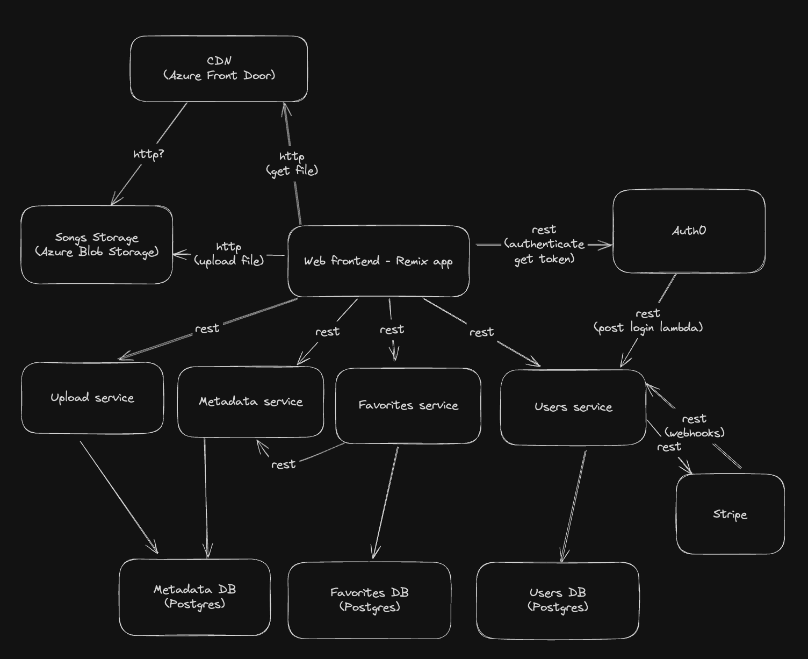

# Naslov projekta: SoundScape

### Projektna skupina:

- številka: Samostojno 02
- ime: Marko Gartnar
- člani: Marko Gartnar

### Povezava do repozitorija/-ev kode ali ustvarjene organizacije

- [Github organizacija](https://github.com/orgs/mg-prpo-2024/repositories)
- [users storitev](http://72.144.111.234/docs)
- [upload storitev](http://4.182.133.97/docs)
- [metadata storitev](http://72.144.120.236/docs)
- [favorites storitev](http://4.182.130.71/docs)

### Kratek opis projekta

SoundScape je platforma za pretakanje glasbe, podobna Spotify, ki uporabnikom omogoča enostaven dostop do obsežne izbire skladb, albumov in izvajalcev. Uporabniki si ustvarijo račun in izberejo plačajo naročnino za dostop do vsebin. Platforma omogoča, da uporabnik postane ustvarjalec in kreira albume, pesmi, ... Uporabniki lahko tudi ustvarjajo in urejajo svoje sezname predvajanja in všečkajo pesmi.

### Ogrodje in razvojno okolje

- VSCode
- Golang - [Huma](https://huma.rocks/) + chi router
- Postgres
- Docker, Docker Compose
- Kubernetes
- Github Actions
- React, Remix

### Shema arhitekture

### Seznam funkcionalnosti mikrostoritev

- users storitev
  - kreiranje uporabnika na podlagi Auth0 prijave
  - stripe webhook za potrdilo plačila
  - status plačil
  - status "customer" objekta iz Stripe-a
- upload storitev
  - kreiranja ustvarjalca (uporabnik lahko postane ustvarjalec)
  - kreiranje albumov
  - kreiranje pesmi, generiranje sas urlja za nalaganje datoteke
  - brisanje pesmi iz baze in blob storage-a
- metadata storitev
  - pridobivanje albumov, pesmi albuma
  - pridobivanje ustvarjalcev, albumov ustvarjalca
  - pridobivanje pesmi z seznamov identifikatorjev pesmi (?ids=1,2,3,4)
- favorites storitev
  - kreiranje, pridobivanje playlistov
  - dodajanje, brisanje pesmi iz playlista
  - dodajanje, brisanje pesmi iz seznama všečkanih pesmi
  - preverjanje prisotnosti pesmi v seznamu všečkanih pesmi

### Primeri uporabe

- registracija, prijava
- izbira naročnine, plačilo, pregled plačil
- uporabnik postane ustvarjalec, ustvari albume in pesmi
- uporabnik predvaja pesem v brskalniku
- prikaz seznama albumov, prikaz seznama pesmi albuma
- uporabnik všečka pesem, status všečkanosti se prikaže na vseh seznamih pesmi (album, playlist)
- uporabnik ustvari playlist, doda in briše pesmi iz playlist-a

### Seznam opravljenih/vključenih osnovnih in dodatnih projektnih zahtev

- **Registracija/prijava, avtentifikacija**
  Za avtentifikacijo sem uporabil storitev Auth0. Ustvaril sem dva tenanta, za produkcijo in development. Na React SPA Auth0 SDK pridobi access token in samodejno uporabi refresh token ko access token poteče. Vsaka storitev uporabi middleware, ki iz Auth0 avtorizacijskega strežnika pridobi javne ključe za verifikacijo in nato na http requestih verificira token [(link do kode)](https://github.com/mg-prpo-2024/soundscape/blob/main/shared/auth.go#L44). Na Auth0 sem registriral post-login lambda trigger, ki kliče `users` storitev in ustvari uporabnika v bazi, če uporabnik še ni registriran.

- **Nakup naročnine**
  Za naročnine sem na Stripe-u registriral tipe naročnin kot produkt (študentska in premium, oz. navadna). API končna točka na users storitvi uporabi Stripe go api, da ustvari "checkout sesion" in na frontend vrne link do stripe-ove strani za plačilo. Po uspešnem plačilu stripe kliče webhook na users storitvi, ki shrani potrebne stripe-ove identifikatorje za uporabnika v users bazo. Trenutno se shrani samo customer_id, ostalo podatke lahko z njim dobim iz stripe-ovega api-ja.

Pri obeh storitvah, Auth0 in Stripe, obstaja kompromis med shranjevanjem podatkov zunanjega api-ja pri sebi in pridobivanjem zunanjih podatkov iz api-ja. Lokalno hranjenje zunanjih podatkov je bolj cenovno ugodno, predstavlja pa tveganje napak pri sinhronizaciji preko webhook-ov.
Za stripe sem se odločil za hranjenje uporabnikovih podatkov v svoji bazi, ker se api končne točke, ki potrebujejo uporabnika kličejo pogosto in se s tem izognem klicu na Auth0. Podatke končnih točk za plačila dobim iz stripe-ovega api-ja, ker se večino teh točk ne kliče pogosto in so napake pri plačilih drage.

- **Ustvarjanje albumov, pesmi, ustvarjalcev, nalaganje pesmi**
  Naslednja storitev, ki sem jo implementiral je `upload`storitev. Implementiral sem standardne CRUD končne točke za ustvarjanje ustvarjalcev, albumov, pesmi. Končni točki za kreiranje in brisanje pesmi sta bolj zanimivi, ker uporabljata azure blob storage. Za nalaganje nove pesmi `upload` storitev ustvari kratkotrajen SAS url, ki ga client (React app) uporabi da direktno nalaganje ([koda](https://github.com/mg-prpo-2024/soundscape/blob/main/services/upload/internal/storage.go#L61)). Trenutno imata končni točki za ustvarjanje in brisanje pesmi problem da pisanje v `metadata` bazo in azure storage ni transakcijsko. Tega nisem obravnaval, ampak ideja je bila, da bi mutacije poslal v nek queue. sporočila bi worker strežniki prevzeli in poleg drugih stvari (ustvarjanje nižjih kvalitet pesmi, računanje trajanja pesmi, ...) poskrbeli še da je sta azure storage in `metadata` baza "eventually consistent". Za hitrejšo dostavo datotek brskalniku sem še pred azure blob storage postavil CDN. Uporabil sem Azure Front Door, ker je integracija z Azure Blob Storage trivialna. Tukaj bi moral raziskati, če sta mogoče CloudFront ali Akamai cenovno ugodnejša, glede na to da je to najdražji del cele aplikacije.

- **Prikaz seznama albumov, prikaz seznama pesmi albuma**
  Tretja storitev je `metadata`storitev. Ta storitev je read-only, izpostavi precej standardne končne točke za branje metapodatkov pesmi, albumov, ustvarjalcev.

- **Všečkanje pesmi, prikaz statusa všečkanosti na vseh seznamih pesmi (album, playlist)**
- **Ustvarjanje playlistov, dodajanje in brisanje pesmi iz playlista**
  Četrta storitev je `favorites` storitev, ki obravnava playlist-e in všečkane pesmi. Storitev izpostavi standardne CRUD končne točke, ki pišejo v `favorites` bazo. Tukaj hranim samo identifikatorje pesmi, metapodatke pa pridobim `metadata` storitve s pomočjo bulk GET končne točke za pesmi (GET /songs?ids=1,2,3,4,5). Ena zanimiva končna točka je za preverjanje prisotnosti pesmi v seznamu všečkanih pesmi. Uporabim jo, da lahko pokažem katere pesmi so všečkane na seznamu pesmi iz albuma ali playlista ([koda](https://github.com/mg-prpo-2024/soundscape/blob/main/services/favorites/internal/songs/api.go#L120)).
