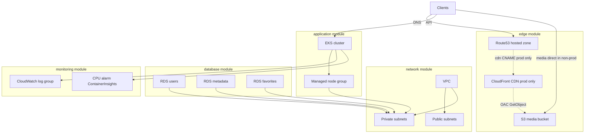
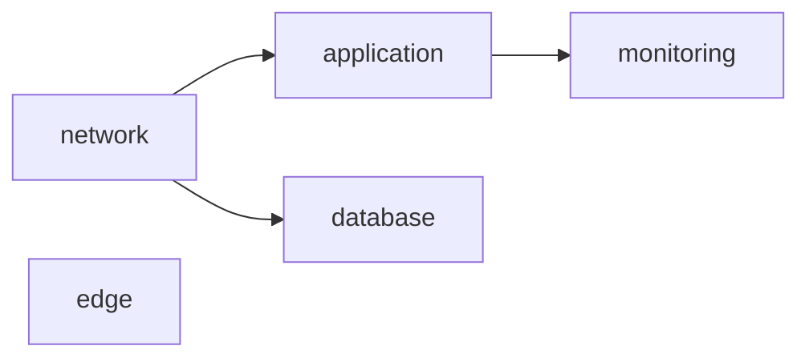
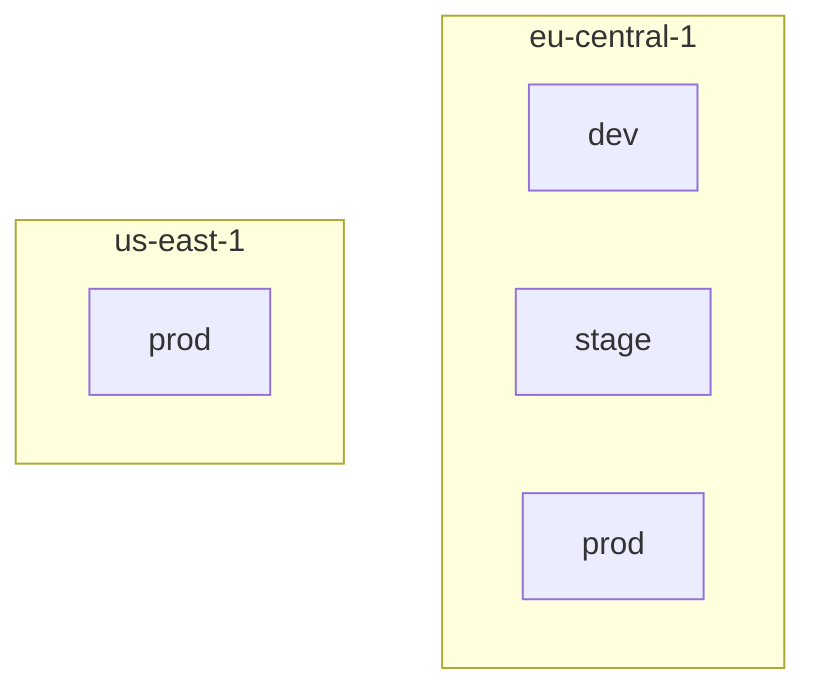

# Infrastructure architecture

Reference AWS layout for one deployment unit. Auth0 and Stripe are external and not provisioned by this repo.

Source of truth for parameters: [`../methodology/reference-scenario.md`](../methodology/reference-scenario.md).

## Per-unit AWS architecture

CloudFront is **prod-only**. Dev/stage keep S3 + Route53; clients talk to EKS and S3 without a CDN hop.

## Module dependency graph

- **network** — VPC + public/private subnets (CIDR per env/region)
- **edge** — S3 + Route53 always; CloudFront + `cdn.` record only when `enable_cdn = true` (prod)
- **application** — EKS in private subnets
- **database** — three RDS instances (users, metadata, favorites) in private subnets
- **monitoring** — watches the EKS cluster

## Deployment units

| Unit | DNS zone | CDN |
| --- | --- | --- |
| `dev/eu-central-1` | `dev.eu-central-1.thesis-app.example` | off |
| `stage/eu-central-1` | `stage.eu-central-1.thesis-app.example` | off |
| `prod/eu-central-1` | `prod.eu-central-1.thesis-app.example` | `cdn.prod.eu-central-1.thesis-app.example` |
| `prod/us-east-1` | `prod.us-east-1.thesis-app.example` | `cdn.prod.us-east-1.thesis-app.example` |

## Application architecture vs this repo

[`architecture-diagram.png`](architecture-diagram.png) is the **application** view (Remix frontend, upload/metadata/favorites/users services).

This document is the **infrastructure** view: how those workloads sit on AWS (EKS, RDS, S3/CloudFront/Route53). Microservices run on the EKS node group; Auth0/Stripe stay SaaS.
